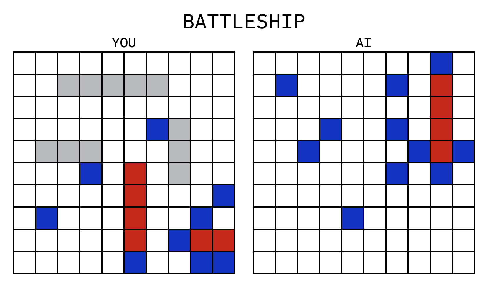

# Battleship

A minimalistic web-based implementation of the classic strategy game Battleship.

## Description

This project is a web-based implementation of the classic Battleship game. A human player can play against an AI of easy or medium difficulty. Each player gets to place 5 ships of lengths 5, 4, 3, 3, and 2 respectively. When placing ships, press any key to rotate the ship. The first player to sink all of their opponent's ships wins! Crafted with precision and a clear coding style, this standalone web app is bundled with Webpack, emphasizing modern web development practices. It also features a simple error logging and game replay system for debugging game crashes.

## Table of Contents

- [Description](#description)
- [Screenshot](#screenshot)
- [Preview](#preview)
- [Features](#features)
- [Installation](#installation)
- [Usage](#usage)
- [Tech Stack](#tech-stack)
- [Project Structure](#project-structure)
- [Game Logging and Playback](#game-logging-and-playback)
- [License](#license)
- [Contact Information](#contact-information)

## Screenshot



## Preview

You can view a live preview of the page [here](https://sourdoughbredd.github.io/battleship/).

## Features

- Player vs Computer gameplay
- Randomized ship placement for the computer
- Drag-and-drop style ship placement for the player
- Easy and Medium Computer AI designs
- Dynamic updates to the game board
- Game Logging and Playback for debugging

## Installation

1. Clone the repository:
   ```sh
   git clone https://github.com/sourdoughbredd/battleship.git
   ```
2. Navigate to the project directory:
   ```sh
   cd battleship
   ```
3. Install dependencies:
   ```sh
   npm install
   ```
4. Build the project:
   ```sh
   npm run build
   ```
5. Open `dist/index.html` in your preferred web browser.

## Usage

- Open `dist/index.html` in a web browser to play the Battleship game.
- Choose your difficulty and press start
- Drop your ships onto the player board, pressing any key to rotate them.
- The game starts when you have placed your last ship.
- Take turns clicking on the computer's board to guess ship locations.
- The game ends when all ships of either the player or the computer are sunk.

## Tech Stack

- HTML
- CSS
- JavaScript (game logic and UI)
- Webpack (build)
- Jest (testing)

## Project Structure

The project is organized into modular components and test files, ensuring maintainability and ease of development. Below is an outline of the key files and their roles within the application:

- `createGameboard.test.js`, `createPlayer.test.js`, `createShip.test.js`: These test files were part of the initial project structure but are currently deprecated and may not accurately reflect the current state of the application logic. An update or refactoring of these tests is pending.
- `game.js`: Central game logic file, orchestrating the flow of the game, state management, and the interaction between different game components. It defines the rules, oversees turns, and tracks the progress of the game.
- `gameObjects.js`: Defines the primary objects used in the game, such as ships, players, and the game board. This file is crucial for establishing the fundamental entities and their interactions within the game.
- `player.js`: Manages player-specific information and actions. It handles the state of each player, including their fleet of ships, moves, and strategy.
- `ui.js`: Manages the user interface, handling user input and rendering the game state to the screen. It ensures that the player's actions are reflected visually and that the game's status is clearly presented.
- `index.js`: Serves as the entry point of the application, initializing the game and tying together different modules.
- `style.css`: Contains the styling rules for the game's interface, ensuring a visually appealing and intuitive user experience.

Each module is designed to be self-contained, promoting separation of concerns and making the codebase more manageable and scalable. The test files (`*.test.js`) are closely aligned with their respective modules, ensuring that any changes in the logic are validated through comprehensive tests.

## Game Logging and Playback

The Battleship Game includes an innovative logging system that captures and stores each game state to the browser's `localStorage`. This feature is invaluable for developers for post-game analysis, especially after a crash or at the end of a game.

### Features:

- **Automatic Logging**: Every action, state change, and significant event during gameplay is automatically logged, including player moves, ship placements, hits, misses, and the conditions at the end of the game.
- **Error Detection**: If the game crashes or behaves unexpectedly, the log is saved to `localStorage`, aiding developers in analyzing the events leading up to the issue.
- **Playback**: The `createReplay()` function in `game.js` generates an object for replaying the game. Developers can use this feature to watch an animated replay of the game, providing a visual and chronological playback of the events.

### Usage:

Logs are automatically saved to `localStorage` at the end of a game (or when a game errors unexpectedly), simplifying the process of accessing and using them for playback.

1. **Accessing Logs**: Logs are stored in the browser's `localStorage`. Access them through the browser's developer tools or via JavaScript by interfacing with `localStorage`. The createReplay() function does this for you automatically.

2. **Initiating Playback**:
   - Locate and uncomment the `createReplay()` function invocation in `index.js`.
   - Call the `createReplay()` function to create a replay object. Then, use the `replayGame(delay)` method of the object instance to start the animated playback of the game. The `delay` input is the amount of time in milliseconds to delay between moves (ship placements & attacks) in the replay.
   - This process reads the stored game logs and animates the game's progress, offering a step-by-step visual representation of the gameplay.

This advanced logging and playback functionality is designed to streamline the debugging process, providing comprehensive insights into the game's dynamics and assisting developers in improving and troubleshooting the game more effectively.

## License

This project is licensed under the MIT License.

## Contact Information

For any questions or suggestions, please contact Brett Bussell at [bwbussell24@gmail.com](mailto:bwbussell24@gmail.com).
